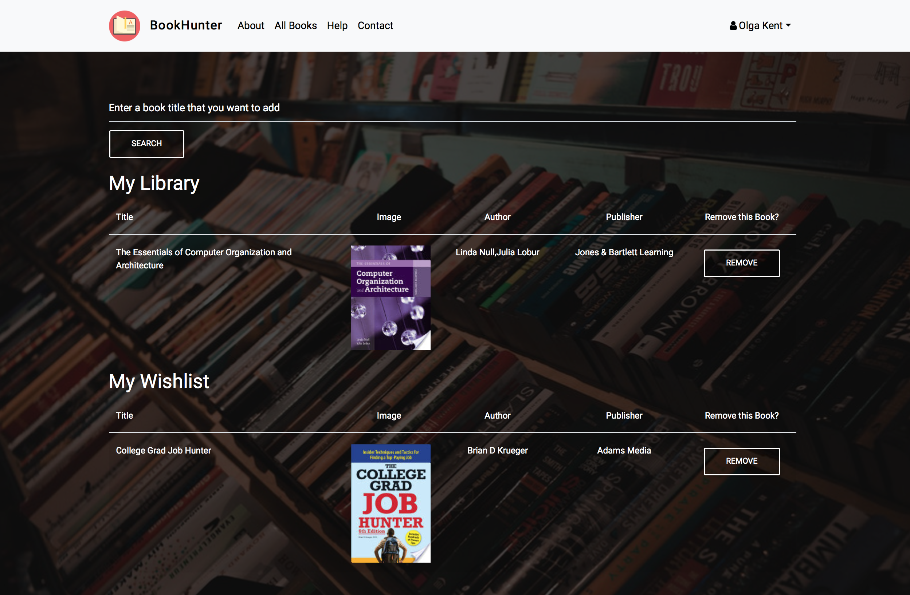
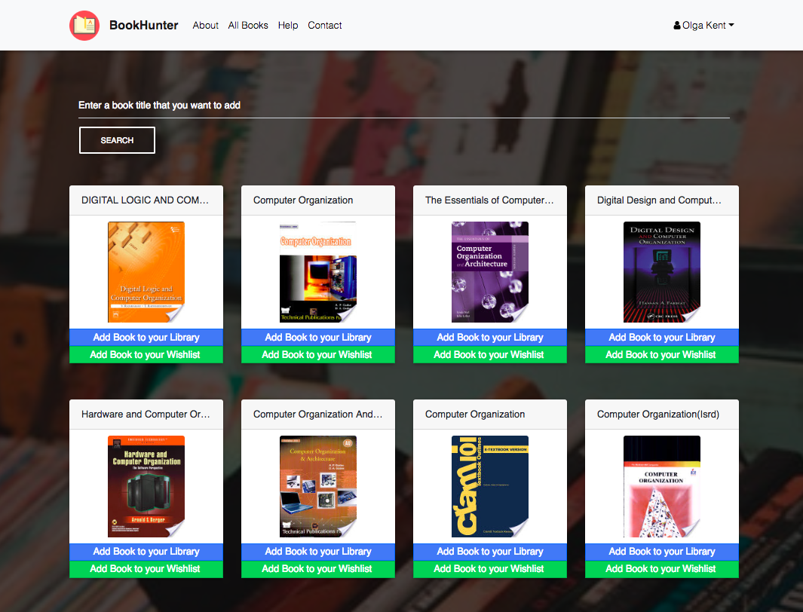

# BookHunter

https://bookhuntercollege.herokuapp.com

Capstone (CSCI499) Project for Computer Science at Hunter College

### Why BookHunter?

Gathering all of your textbooks for a new semester can be tricky, expensive and time consuming! We aim to make this process easier by creating one hub for everyones needs, and best of all, its free!

### Demo

***

### Profile

### Search

### All Books

## __Team Members__
[Matthew Vardi](https://github.com/MatthewVardi)

[Olga Kent](https://github.com/olgakent)

[Tony Jiang](https://github.com/jiangtony)

[Yoseff Cohen](https://github.com/yocohen77)
